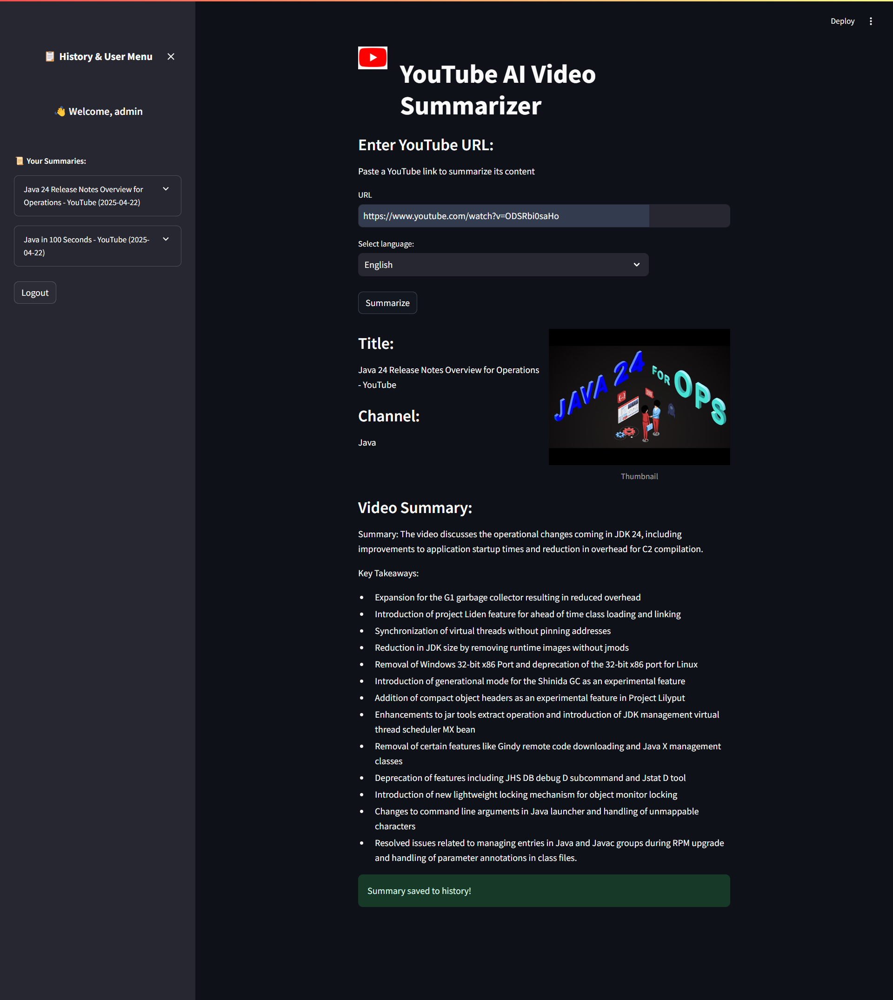

# 🎥 YouTube AI Video Summarizer

This is a **Streamlit-based web app** that allows users to paste a YouTube URL, extract its transcript, and generate an AI-powered summary in a selected language. Users can sign up, log in, and view a **history of their summarizations**.

## 🚀 Getting Started

### 1. Clone the Repository

```bash
git clone https://github.com/yourusername/youtube-summarizer.git
cd youtube-summarizer
```

### 2. Install Dependencies

Make sure you have Python 3.8+ and install requirements:

```bash
pip install -r requirements.txt
```

If `requirements.txt` doesn't exist, install manually:

```bash
pip install streamlit requests beautifulsoup4 youtube-transcript-api openai
```

---

### 3. Set Your OpenAI API Key

In your environment or directly in `summarize_text.py`:

```python
OpenAI.api_key = "your-openai-api-key"
```

Or set it as an environment variable:

```bash
# On Linux/macOS
export OPENAI_API_KEY=your-openai-api-key

# On Windows
set OPENAI_API_KEY=your-openai-api-key
```

---

## 🗃️ Database Setup

Initialize the database using:

```bash
python init_db.py
```

This will create a `users.db` file with:

- `users` — stores usernames and passwords
- `languages` — preloads English, Spanish, and Korean
-  `history` — stores summary history for each user

You can view/edit the database using [DB Browser for SQLite](https://sqlitebrowser.org/).

---

## 💻 Running the App

Start the Streamlit app with:

```bash
streamlit run app.py
```

Then open the URL shown in the terminal (usually `http://localhost:8501`) in your browser.

---


Paste a YouTube link to summarize its content (must have a transcript available)


